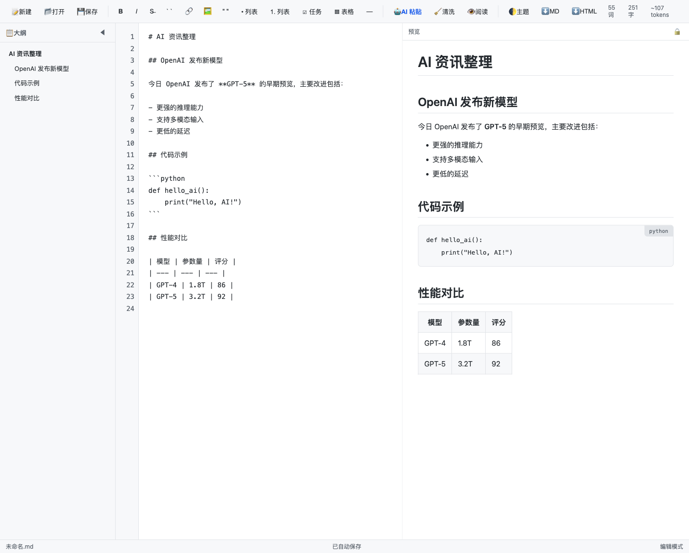
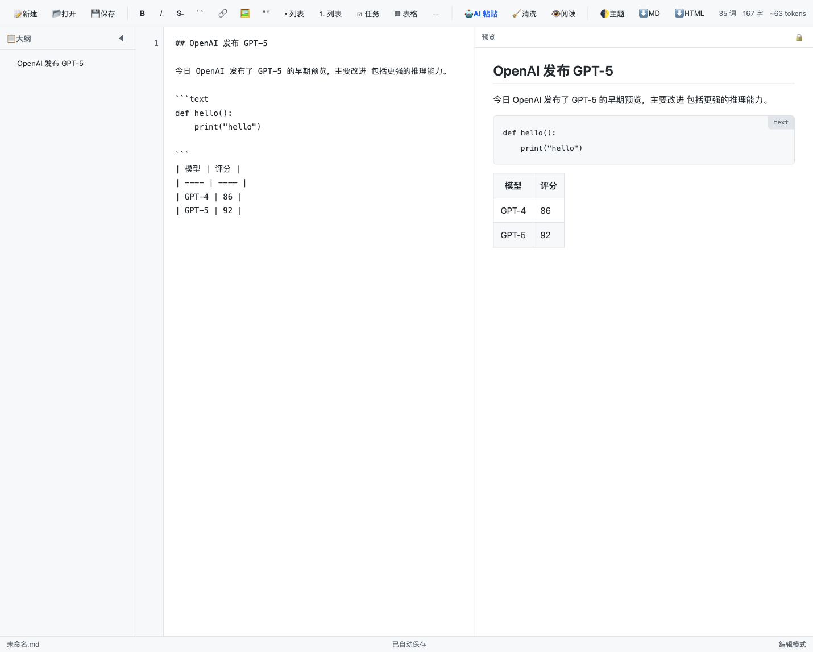
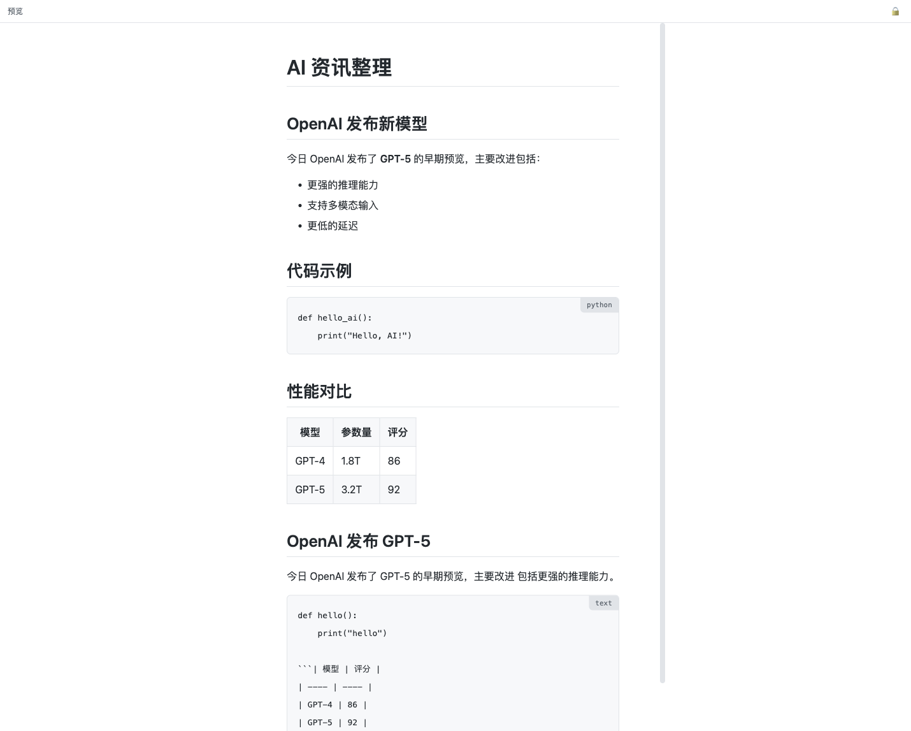
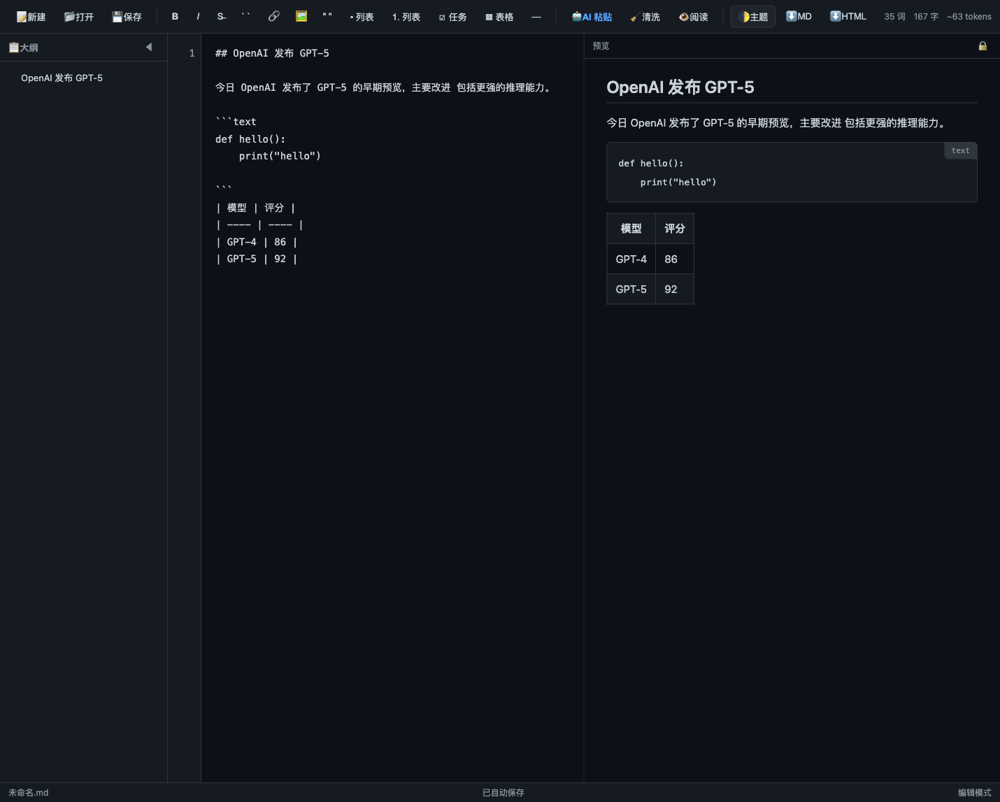

# AI Mark — AI 资讯 Markdown 编辑器

一款面向 **AI 大模型网络资讯** 复制、阅读和编辑的轻量级 Markdown 编辑器。

> 无需构建工具，直接在浏览器中打开即可使用。

## 功能特性

### 核心编辑
- 左侧源码编辑 + 右侧实时预览的分栏布局
- 行号显示与同步滚动
- 常用 Markdown 格式工具栏（加粗、斜体、链接、图片、列表、表格、代码等）
- 自动保存到浏览器本地存储
- 本地文件打开 / 保存（支持 File System Access API，兼容旧浏览器回退方案）

### 为 AI 内容优化
- **AI 智能粘贴**：从 ChatGPT、Claude、Kimi、Gemini 等页面复制内容后，一键清洗为规范 Markdown
- **文档清洗**：对整篇文档执行清洗，移除复制按钮残留、规范标题层级、修复代码块语言标识等
- 自动识别并转换 HTML 表格为 Markdown 表格
- 合并 AI 输出中常见的错误断行
- 代码块语法高亮 + 一键复制
- 数学公式渲染（KaTeX）：支持 `$...$` 和 `$$...$$`

### 阅读与导出
- 专注阅读模式（隐藏编辑器，全屏预览）
- 自动生成文档大纲，点击跳转
- 导出为 Markdown 文件
- 导出为独立 HTML 文件（含样式与公式支持）
- 浅色 / 深色主题切换

### 统计信息
- 实时显示词数、字数、Token 估算

## 界面预览









## 快速开始

1. 克隆或下载本项目。
2. 用浏览器直接打开 `index.html`：

```bash
# macOS
open index.html

# 或使用 Python 启动本地服务器（推荐，避免跨域限制）
python3 -m http.server 8080
# 然后访问 http://localhost:8080
```

## 快捷键

| 快捷键 | 功能 |
| --- | --- |
| `Ctrl/Cmd + N` | 新建文档 |
| `Ctrl/Cmd + O` | 打开文件 |
| `Ctrl/Cmd + S` | 保存文件 |
| `Ctrl/Cmd + Shift + V` | AI 智能粘贴 |
| `Ctrl/Cmd + Shift + R` | 切换阅读模式 |
| `Ctrl/Cmd + B` | 加粗 |
| `Ctrl/Cmd + I` | 斜体 |
| `Tab` | 插入两个空格 |

## 项目结构

```
.
├── index.html          # 应用入口
├── styles/
│   └── main.css        # 界面样式
├── scripts/
│   ├── ai-paste.js     # AI 内容清洗模块
│   └── main.js         # 编辑器主逻辑
└── README.md           # 说明文档
```

## AI 智能粘贴说明

在浏览 AI 对话页面时，复制整段回答内容，回到编辑器后按 `Ctrl/Cmd + Shift + V` 或点击工具栏的 **🤖 AI 粘贴**，粘贴到弹窗中并点击“插入到编辑器”。清洗选项包括：

- 移除“复制代码”按钮残留
- 规范标题层级
- 识别并转换表格
- 修复代码块语言标识
- 合并错误换行

## 技术栈

- 原生 HTML5 / CSS3 / JavaScript（无构建步骤）
- [marked](https://marked.js.org/)：Markdown 解析（CDN，失败时启用内置降级解析器）
- [KaTeX](https://katex.org/)：数学公式渲染（CDN，失败时忽略公式）
- [highlight.js](https://highlightjs.org/)：代码语法高亮（CDN，失败时原样显示）
- [DOMPurify](https://github.com/cure53/DOMPurify)：HTML 安全过滤（CDN，失败时简化过滤）

> 提示：默认使用 CDN 加载依赖以获得最佳体验。若处于离线或弱网环境，内置的 `fallback.js` 会接管基础 Markdown 渲染，确保编辑器仍可正常使用。

## 后续可扩展

- 多标签页编辑
- 全文搜索与替换
- 图片拖拽上传 / 本地图片嵌入
- 与本地 AI 模型接口对接，实现续写、润色
- 导出为 PDF
- 插件系统

## License

MIT
